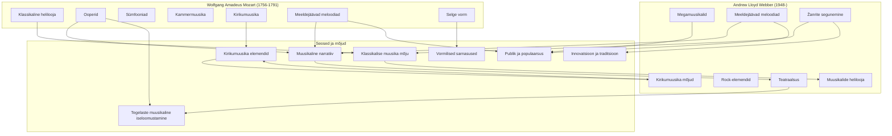

```mermaid
flowchart TD
    subgraph Mozart["Wolfgang Amadeus Mozart (1756-1791)"]
        M1[Klassikaline helilooja]
        M2[Ooperid]
        M3[Sümfooniad]
        M4[Kammermuusika]
        M5[Kirikumuusika]
        M6[Meeldejäävad meloodiad]
        M7[Selge vorm]
    end

    subgraph Webber["Andrew Lloyd Webber (1948-)"]
        W1[Muusikalide helilooja]
        W2[Rock-elemendid]
        W3[Teatraalsus]
        W4[Megamuusikalid]
        W5[Kirikumuusika mõjud]
        W6[Meeldejäävad meloodiad]
        W7[Žanrite segunemine]
    end

    subgraph Seosed["Seosed ja mõjud"]
        S1[Klassikalise muusika mõju]
        S2[Muusikaline narratiiv]
        S3[Tegelaste muusikaline iseloomustamine]
        S4[Kirikumuusika elemendid]
        S5[Vormilised sarnasused]
        S6[Publik ja populaarsus]
        S7[Innovatsioon ja traditsioon]
    end

    M1 --> S1
    M6 --> S2
    M6 --> S6
    M7 --> S5
    M5 --> S4
    M2 --> S2
    M2 --> S3

    W5 --> S4
    W6 --> S2
    W6 --> S6
    W7 --> S1
    W7 --> S7
    W3 --> S3
    W4 --> S6

    S1 --> W1
    S2 --> W3
    S4 --> W5
```
